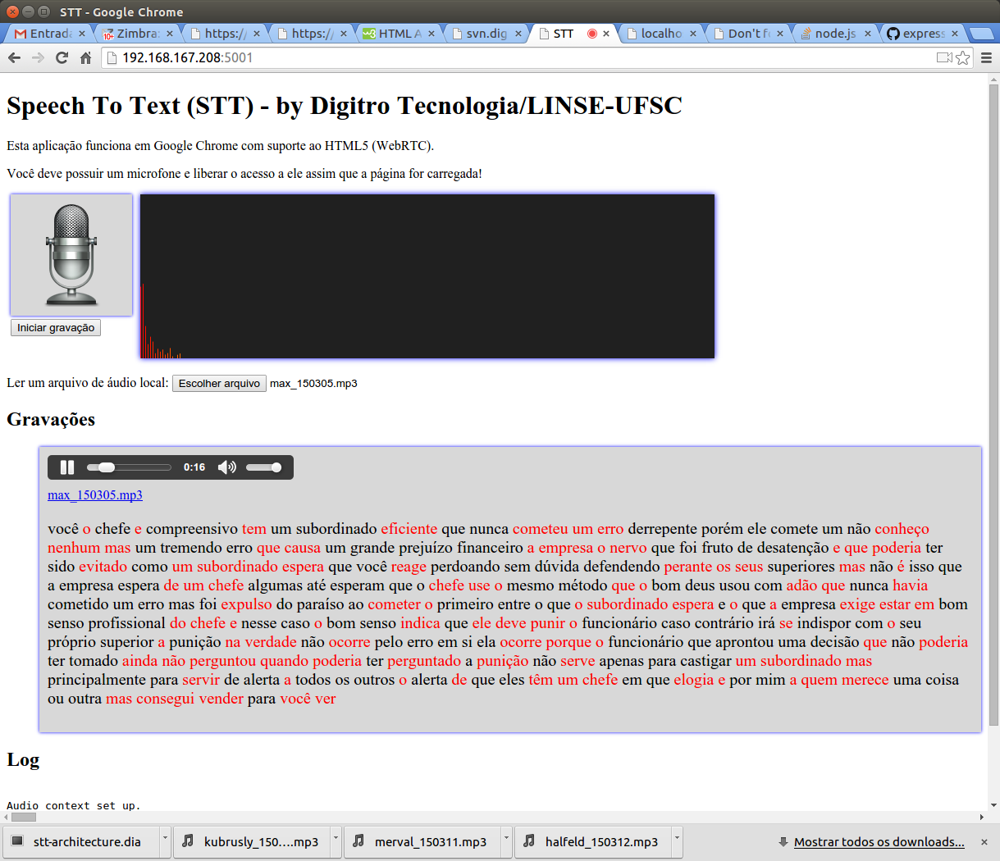
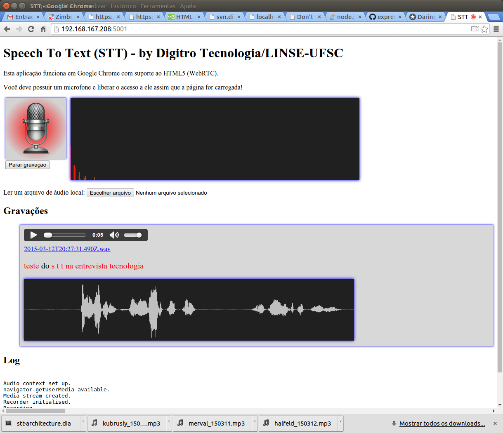

# Demo STT
Este é uma demonstração de uso da tecnologia STT (Speech To Text) desenvolvida pelo LINSE - UFSC.

Esta aplicação também demonstra o uso da tag audio do HTML5, com recursos como gravação do microfone.

## Funcionalidades

1) É possível gravar o áudio diretamente do microfone ou carregar um arquivo .mp3 ou .wav que esteja no cliente.

2) Na transcrição, as palavras em vermelho indicam que o score foi abaixo de 1. As palavras em preto tiveram score 1. O "tip" de cada palavra mostra o "score".

3) Quando se dá o play do áudio, a palavra que está sendo reproduzida é destacada.

4) clicando sobre uma palavra da transcrição, o áudio é posicionado na palavra.

5) Nas gravações realizadas a partir do microfone é criado um gráfico da onda.
Clicando numa posição desta imagem, atualiza-se a posição na tag áudio e no texto.
Ou seja, os três controles são sincronizados (controle do áudio, palavras das transcrição e a imagem da onda).

## Desenvolvimento

### Pastas

- audio: pasta onde os arquivos de áudio são gravados antes de serem enviados para transcrição. Isto foi feito apenas para verificar o áudio que foi transcrito, ou seja, não é necessário gravar o áudio nesta pasta.         Pode ser retirado na versão final. A aplicação remove os arquivos desta pasta sempre que inicia.

- demo: acessível via http://localhost:5000/demo, contém a aplicação original utilizada como referência.
- examples: arquivos mp3 e wav utilizados nos testes.
- img: imagens utilizadas na página.
- index.html: arquivo html da página principal
- js: contém os arquivos javascript da aplicação no browser
  - js/audiodisplay.js: funções que controlam a exibição da imagem da onda do áudio.
  - js/recorder.js: funções para realizar gravação, transformar em WAV, etc
  - js/recorderWorker.js: funções para realizar gravação, transformar em WAV, etc
  - js/stt-main.js: módulo principal da aplicação no browser.
- package.json: arquivo contendo os requisitos deste projeto.
- web.js: arquivo principal da aplicação node.js que inicia o servidor REST na porta 5000.

## Screen Shots

### Áudio carregado

### Áudio gravado

